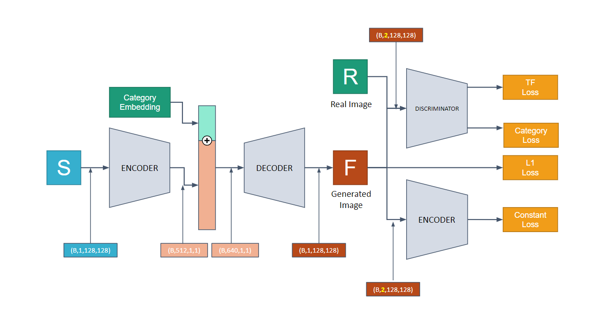
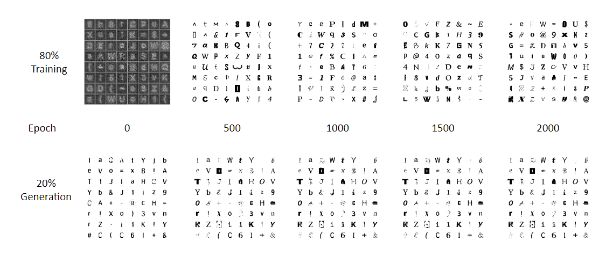
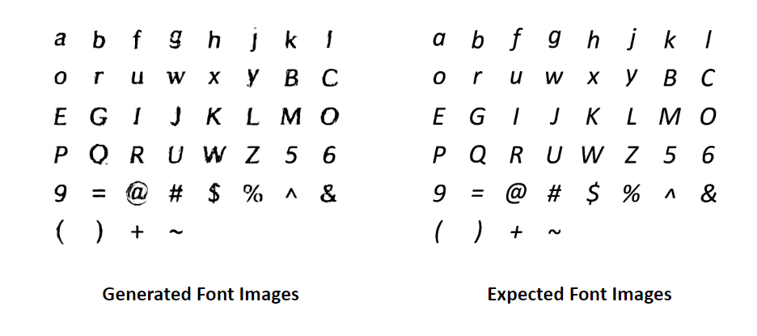

# FontGenerator
Alphabet font generator using GAN, inspired from zi2zi, pix2pix and other similar GAN projects. 
(Experimented in Windows11 / RTX2070super / RAM 16GB)

## Project Objective
The objective of out project is to make a GAN model that learns font styles from other pre-existing fonts. Making a new font style is a very difficult task but generative adversarial network (GAN) can reduce the time cost. There are several prior researches proving that GAN is a good style transfer model. 
We trained the GAN model to generate a font image, where the generator creates a fake image and the discriminator distinguishes whether it is generated. With pre-training and fine-tuning the model, we were able to train the model to learn the font styles. Through this, it can be assured that GAN has a potential to simplify the font style production work by creating the entire font data with only a small number of font data.


## Implementation


## Reproduction
### Set conda environment
```
$ cd ./FontGenerator
$ conda env create --file conda_requirements.yaml
$ conda activate FontProject
```
### Make Directory
```
$ mkdir ./results
$ mkdir ./results/ckpt
$ mkdir ./results/ckpt/pre_train
$ mkdir ./results/ckpt/finetune
$ mkdir ./results/fake-image/pre_train
$ mkdir ./results/fake-image/pre_train/valid
$ mkdir ./results/fake-image/finetune
$ mkdir ./results/fake-image/finetune/valid
$ mkdir ./train/dataset
```
### 1. Install Font files and convert to images
```
https://drive.google.com/file/d/1iRYDXJbH_x4Kabr52LudkvE8JnspLaN6/view?usp=sharing
Extract font files in Util/Font
$ python Util/FontImageGerator.py
```
### 2. Install Pretrained model files
```
https://drive.google.com/file/d/1nu4fKGHy5HVb_s_k425R8LquvBHgXxVJ/view?usp=share_link
Extract model files in ./results/ckpt/pre_train
```
### 3. Pretrain
If trying to reproduce pretrain model
If don't trying to train and just use trained model parameters pass.
```
$ python ./train/train.py
```

### 4. Pretrain Validation(Inference)
```
$ python ./train/valid.py
```
validation results are in results/pre_train/valid-*.png
Target results are results/pre_train/valid-true-*.png

### 5. Finetuning
```
$ python ./train/finetune.py
```

### 6. Result Images
```
Check images in ./results/fake-image/finetune
```

### 7. Evaluation Table
```
$ python ./main.py
```

## Training Results
<div align="center">

||Train|Validation|Finetuning|
|------|---|---|---|
|L1 loss (x100)|0.3913|1.1322|0.0674|

</div>


### Training(80%) and Validation(20%)


### Training Loss


### Finetunning Results - Italic Calibri



## References
* [**zi2zi**](https://github.com/kaonashi-tyc/zi2zi/)
* [**zi2zi-blog**](https://kaonashi-tyc.github.io/2017/04/06/zi2zi.html)
* [**GAN-handwriting-styler**](https://github.com/jeina7/GAN-handwriting-styler)
* [**GAN-handwriting-styler-blog**](https://jeinalog.tistory.com/15)
* [**GAN-goodfellow**](https://arxiv.org/pdf/1406.2661.pdf)
